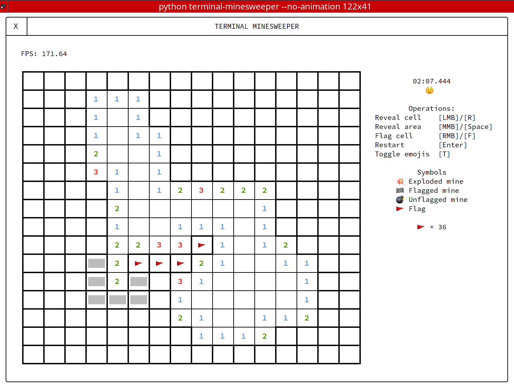
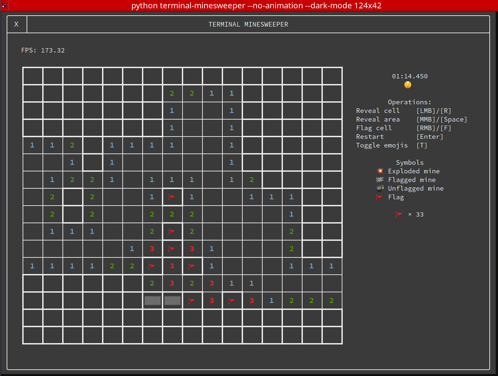

# Minesweeper, but in terminal

Feeling like playing some minesweeper in terminal, but don't want to stare at the REPL of most of the terminal 
minesweeper implementations? Here you go, that's what terminal minesweeper is here for. This program is written 
in Python with curses and no third party library. Compared to other implementations, this program undoubtedly
look significantly better



It also has a dark mode for people who refuses to embrace the Lord of Light



It supports all minesweeper operations including area reveals and highlights. So, what are you waiting for?
Let's sweep some mines!

## Run
```sh
git clone git@github.com:mia1024/terminal-minesweeper
python3 terminal-minesweeper # no need for cd
```

## Usage
```
usage: terminal-minesweeper [-e | -i | -h | -c WIDTH HEIGHT MINES] [-d]
                            [-f FRAMERATE] [--silent-checks] [--no-animation]
                            [-q] [--ignore-failures] [--no-emoji] [--debug]
                            [--help]

Options:
  -e, --easy            Set the game difficulty to easy (9x9 board with 10
                        mines)
  -i, --intermediate    Set the game difficulty to intermediate (16x16 board
                        with 40 mines). This is the default.
  -h, --hard            Set the game difficulty to hard (16x30 board with 99
                        mines).
  -c WIDTH HEIGHT MINES, --custom WIDTH HEIGHT MINES
                        Set a custom game difficulty.
  -d, --dark-mode       Enable dark mode.
  -f FRAMERATE, --framerate FRAMERATE
                        Cap the framerate. Set to 0 to disable, which is the
                        default.
  --silent-checks       Performs the initial system checks quickly and
                        quietly.
  --no-animation        Skip the startup and closing animations. May cause a
                        significant screen flicker when the program starts.
  -q, --quick           A shortcut argument that is the equivalent of
                        supplying both --silent-checks and --no-animation.
  --ignore-failures     Ignore all failures in the initial system checks. Not
                        recommended.
  --no-emoji            Use unicode characters to replace all the emojis. Note
                        that all emojis used by this program are fromEmoji
                        v1.0 released in 2015.
  --debug               Enable debug mode.
  --help                Show this help message and exit.
```

## Notes about terminals

This program is tested with Terminator and Konsole on Arch Linux 2020.10, Python3.8 and 3.9,
iTerm2 and Terminal on MacOS 10.14.6, Python3.8 and 3.9. I don't have access to a Windows computer so 
I didn't tested it on Windows, but I guess it won't run because curses on Windows is weird.

This program relies heavily on a the any-events (1003) mouse reporting mode of xterm, which is not implemented
on all terminals. Specifically, a [known bug in KDE](https://bugs.kde.org/show_bug.cgi?id=423333) prevents the mouse
from interfacing correctly with this program in Konsole.

The popular terminal on MacOS, iTerm2, intercepts right clicking events. This means that you won't be able to flag
cells in iTerm2 with your mouse. However, you can still use the keyboard shortcut (F) for it. 

The built-in terminal on MacOS surprisingly does pass the right click events to the program. However, for the program 
to function correctly, you have to make sure that mouse-reporting is enabled (Under View -> Allow Mouse Reporting 
or Cmd-R to toggle). Strangely, when I tested the program with a trackpad I had to click twice for the terminal 
to pass in the left-click event, but not the right-click. 

This program works perfectly in Terminator. 
